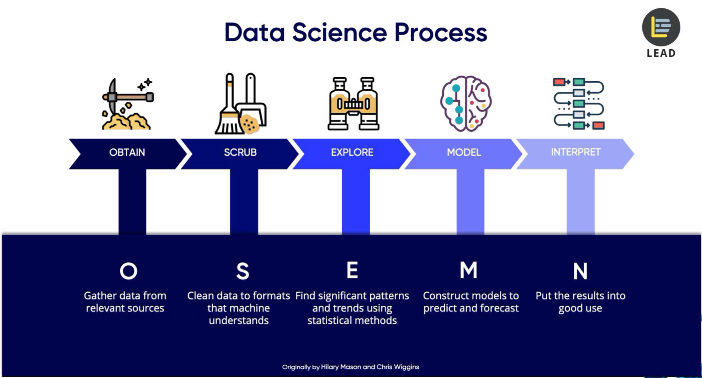
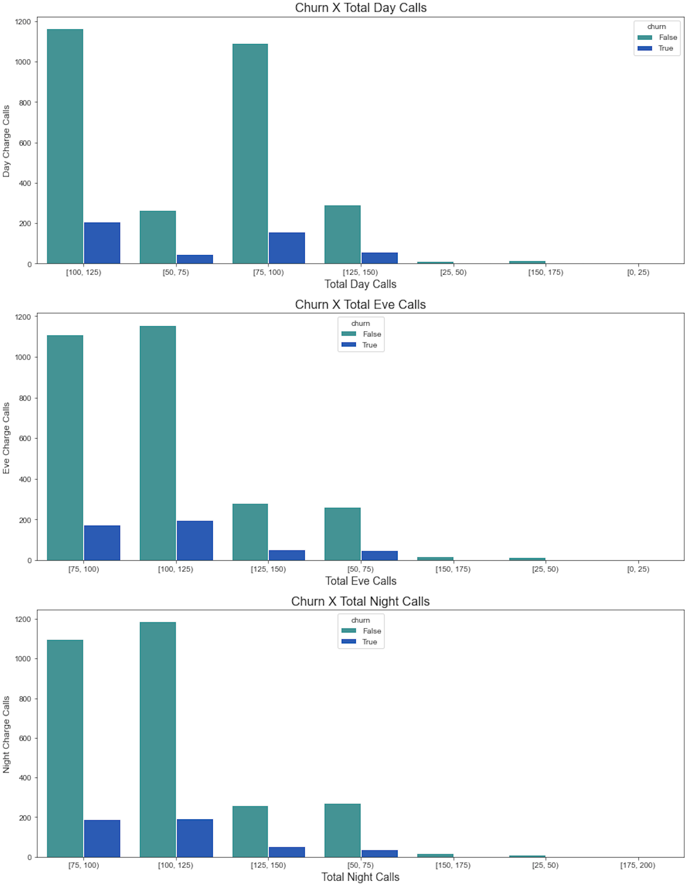
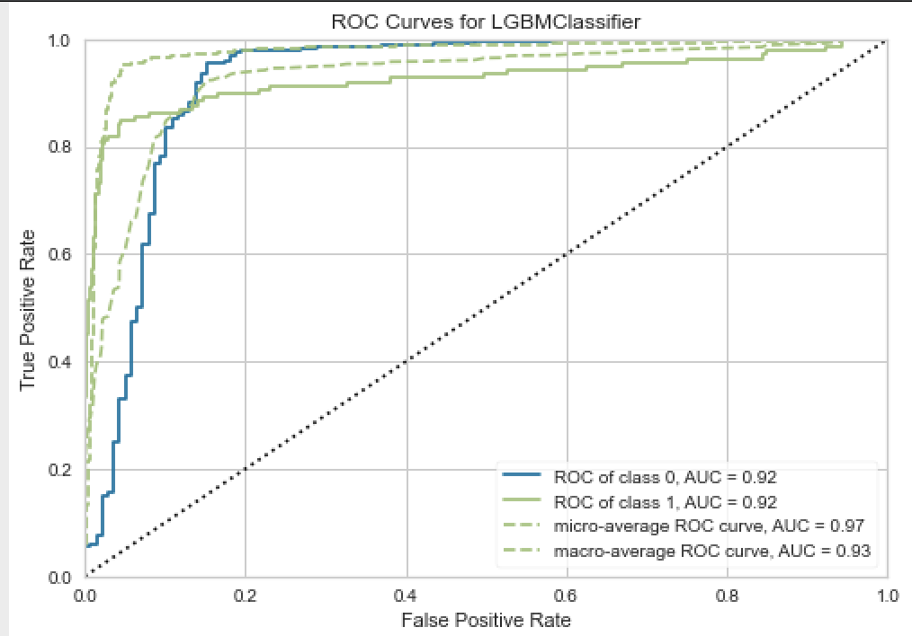
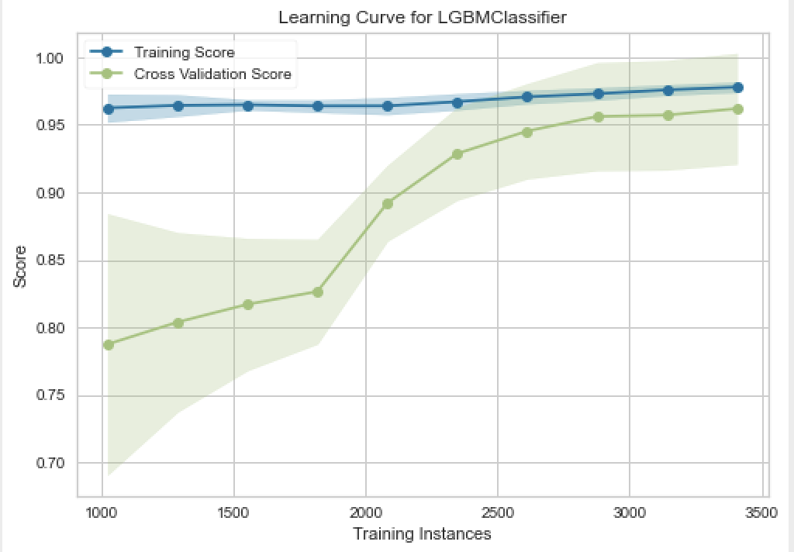
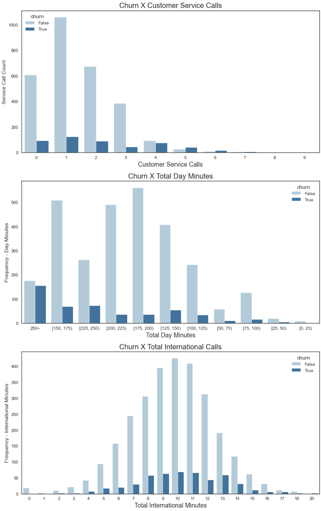

# Telecommunications Company Analysis 
## Predicting Customer Churn

* **Authors**: Miguel Santana
* **Student Pace**: Full Time
* **Instructor name**: James Irving

### Business problem:
SyriaTel is a telecommunications company looking to improve customer churn. The company provided client data in order to better understand whether a consumer would stop doing business with the company. The OSEMN framework will be used to analyze the dataset and prepare it for machine learning algorithms that will classify feature importance. Selected features will be used to give business insight and reduce customer churn.

### Data
The The SyriaTel dataset is available on Kaggle's website. The dataset can be found [here.](https://www.kaggle.com/becksddf/churn-in-telecoms-dataset) 

## Process

**The OSEMN Framework was used to analyze the data**

## Exploratory Data Analysis | Total Customer Calls
**Visualizing Day, Eve and Night Calls**

## Top Model: Light Gradient Boosting Machine 
### Model Performance
* **ROC Curve**

* **Confusion Matrix**

* **Model Learning Curve**

# Conclusion, Insights and Future Work
## Conclusion
The dataset offered various consumer trends and illustrated multiple areas of opportunity. Two areas of opportunity addressed common retail business pitfalls; customer service and high cost products (international minutes being the most expensive). Lastly, day minutes are the most common of the available categories and directly influenced the majority of consumer costs. These and future trends can be used to prepare for future business.

## Top Features
* **Visualizing Top Features**

## Business Recommendations 

**Customer Service Calls:**
* Churn is highest during the first 3 customer service interactions. SyriaTel should deploy an A-Team of high performers to address  incoming service calls from new customers.  

**Total Day Minutes:**
* Total day minutes make up the majority of the minutes consumed and therefore relay to the largest percentage of the total cost. SyriaTel can create and market advertisements for consuming minutes during low peak business hours or consider changing their day pricing (adjusting eve, night and intl costs to compensate).

**Total International Minutes:**
* Churn grows exponentially as consumers go over 7 international minutes. SyriaTel should create an outreach campaign to inform customers when they are going over the 5 international minute threshold. SyriaTel should also consider creating a forgiveness program for first time customers who consumed large amounts of international minutes without knowing the cost (one time only). 

Future Work
In order to more accurately define the boundaries of our features it is important to understand what customs and cultural influences are tied to this dataset. SyriaTel is not a United States based cell phone carrier and cultural influences may impact the way we perceive the information. In addition, it would be helpful to have more client specific data in order to understand on an individual level which client segments are leaving the company and what features they share. 

### For further information
Please review the narrative of our analysis in [our jupyter notebook](./churn_student.ipynb) or review our [presentation](./powerpoint.pdf)

For any additional questions, please contact **Miguel Santana at msantana269@gmail.com**)
